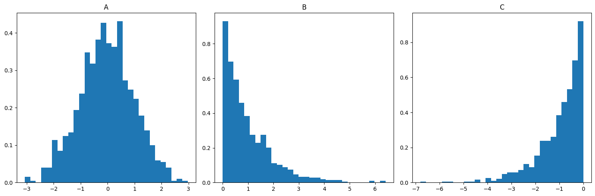
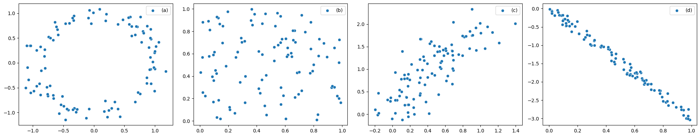

# 2026 過去の中間試験問題

出典: Notion 共有ページ (確率統計論)

## 問1

あるデータには家賃、間取り広さ、駅からの距離、日当たりの良さがA, B, Cなどと書かれている。それらの賃貸物件は1000件あるデータについて、適切であれば◯、そうでなければ×をかけ。

1. 地域ごとに地価が異なるので、地域ごとにデータをわけて考えることを記述統計という
2. サンプルサイズまたはサンプル数は1000である
3. A, B, Cを質的データ、その集合を標本空間といい、数（量）的データ数値に一対一対応させて考えるとき状態空間という
4. 標本誤差とは、例えばコインの表裏が半々の確率でも有限な観測による標本誤差が0.5にはぴったり一致しないその誤差を言う

## 問2

以下の図を左からA, B, Cとし、それぞれあるデータのヒストグラムをあらわす。

1. 最も歪度が小さいものを選べ
2. 2番目に歪度が小さいものを選べ
3. 3番目に歪度が小さいものを選べ
4. 第一四分位数が最も小さいものを選べ
5. 第一四分位数が2番目に小さいものを選べ
6. 第一四分位数が3番目に小さいものを選べ
7. (標本平均値-中央値) が最も小さいものを選べ
8. (標本平均値-中央値) が2番目に小さいものを選べ
9. (標本平均値-中央値) が3番目に小さいものを選べ

## 問3

{ 3, 2, 8, 1, 6, 14, 2, 8 } というデータがあるとします。

1. 標本平均を小数点で求めよ。
2. 第1四分位数 (Q1) を求めよ。
3. 標本分散を求めよ。

## 問4

以下の4つ A, B, C, D の散布図について

1. 相関係数が最も大きいものを選べ
2. R² が最も大きいものを選べ
3. R² が2番目に大きいものを選べ
4. 相関係数が4番目に大きいものを選べ
5. R² が0に近くて、x と y が関係すると考えられるものを選べ
6. 相関がなく、x と y も関係性が乏しいと考えられるものを選べ

## 問5

適切であれば◯、そうでなければ×をかけ

1. 2次元データに因果関係があるなら相関係数が常に高い
2. x と y は標準化（正規化）されたデータである時、相関係数 r は回帰直線の傾き a に一致し切片は0である
3. 外れ値があろうとも R² の取りうる値は -1 から 1 に値を取る
4. y = f(x) = 1/(0.01 + x²) で y が与えられるデータ (x, y) のスピアマン相関係数は -1 である

## 問6

1から100までの自然数の中から同様に確からしい確率でランダムに1つの数字を選ぶ。このとき、5の倍数である事象と2の倍数である事象の確率はそれぞれ (a), (b) であり、5の倍数である事象と2の倍数である事象の共通集合の確率は (c) である。ただし、(a), (b), (c) は（既約）分数で答えよ。

## 問7

5円が3枚、1円が5枚を同時に投げる。5円の表の枚数を X, 1円の表の枚数を Y とし、コインは全て独立で同様に確からしい確率であるとする。

1. 表のでた合計金額について、期待値を求めよ。
2. 表のでた合計金額について、分散を求めよ。
3. (X = 2 かつ Y = 4) となる確率を（既約）分数で答えよ。
